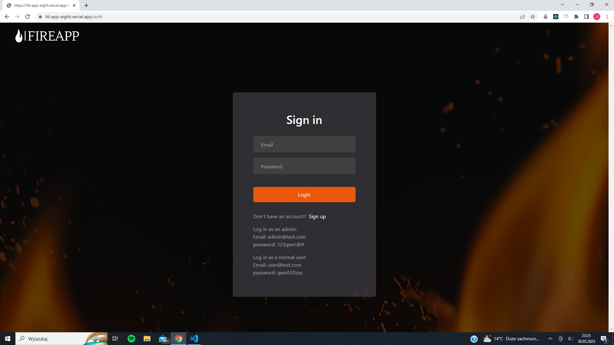
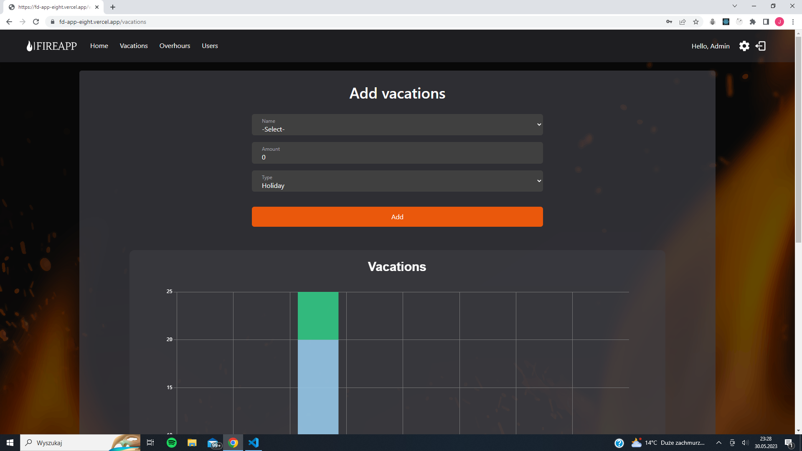
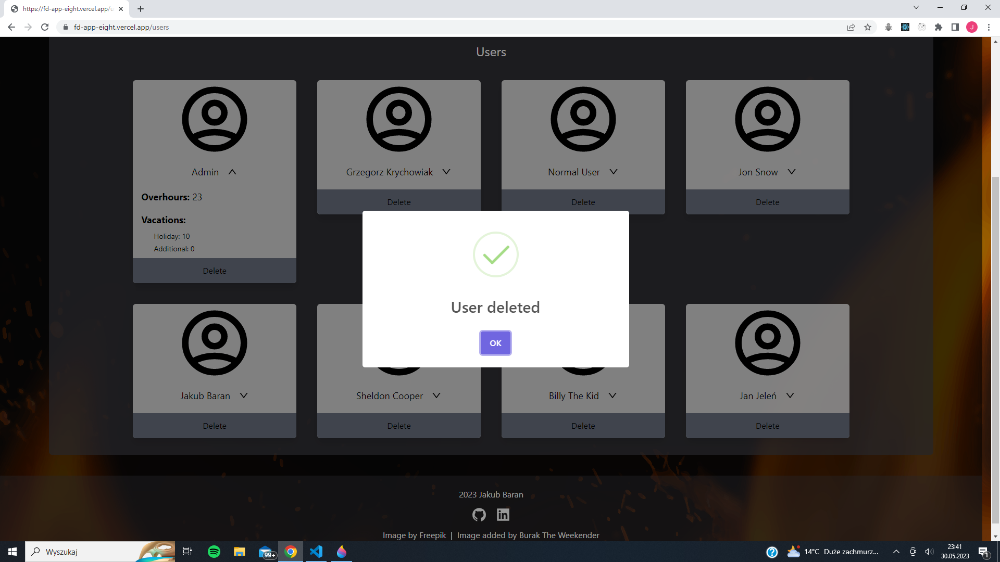
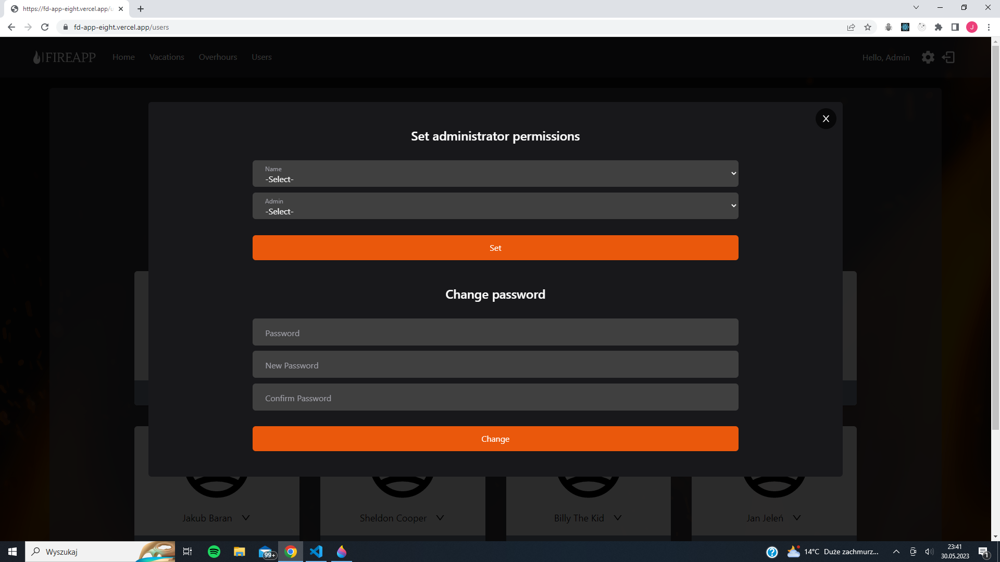
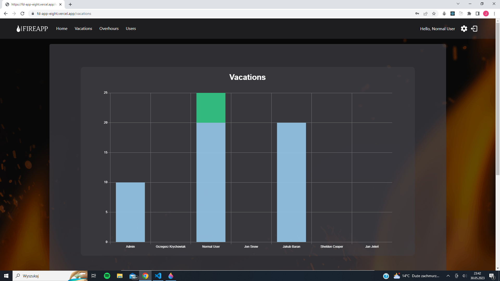
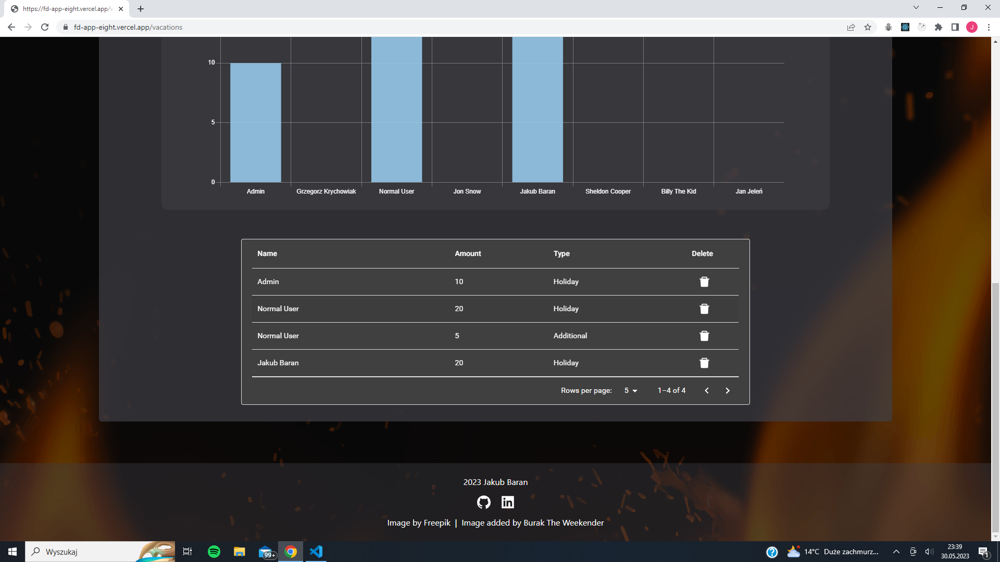

# FireApp

FireApp is a web application built using Next.js, TypeScript, Prisma, Tailwind CSS, PostgreSQL and Supabase. It is a platform for managing crews in the fire brigade. The app offers various features such as user registration, authentication, change management, and user administration.

## Characteristics

- **User Registration**: Users can register in the app using a username that is verified against the existing firefighter database. Password is required and must be at least 8 characters long.

- **Authentication**: the application uses the `next-auth/react` library for authentication. Once authenticated, users can access a personalized dashboard and perform various actions based on the permissions assigned to them.

- **Change management**: Users with administrator privileges can add and delete change records. Each user can change their password. Shift records contain vacation, overtime, and other relevant details. The data is stored in a PostgreSQL database.

- **User Administration**: Admin users have additional privileges such as the ability to delete any record, delete users, and assign admin privileges to other users.

  

- **Visualization**: The app includes interactive charts powered by "react-charts" to display change data in a visual format. Users can view charts to have information in an accessible form.

- **UI Libraries**: FireApp also uses Material-UI components to design intuitive and responsive user interfaces, giving your application a modern and polished look.

- **API integration**: the application integrates with Supabase using `axios` and `swr`. Retrieves and updates data from external APIs.

- **Data Security**: Passwords are securely stored using bcrypt encryption, ensuring the confidentiality and integrity of user credentials.

## Technologies Used

- Next.js
- TypeScript
- Prisma
- Tailwind CSS
- PostgreSQL
- Supabase
- next-auth/react
- Zustand
- Lodash
- Bcrypt
- SweetAlert
- react-charts
- Material-UI
- Axios
- SWR
- JWT (JSON Web Tokens)

## Installation and Setup

To run FireApp locally on your machine, follow these steps:

1. Clone the repository:

`git clone https://github.com/baranero/fd-app.git`

2. Install dependencies:

`cd fd-app`  
`npm install`

3. Create a .env file in the root of the project.

4. Configure the following environment variables in the .env file:

DATABASE_URL: The URL to your PostgreSQL database in Supabase. 
NEXTAUTH_JWT_SECRET: The secret key for JWT authentication. 
NEXTAUTH_SECRET: The secret key for next-auth/react.

4. Run the development server:

`npm run dev`

The application will be accessible at `http://localhost:3000`.

## Contributing

Contributions to FireApp are welcome. If you would like to contribute, please follow these guidelines:

1. Fork the repository.

2. Create a new branch for your feature or bug fix:

`git checkout -b my-feature`

3. Make your changes and commit them:

`git commit -m "Add my feature"`

4. Push the changes to your forked repository:

`git push origin my-feature`

5. Open a pull request on the main repository.

Please ensure that your code follows the project's coding conventions and includes appropriate documentation where necessary.

## License

This project is licensed under the [MIT License](https://opensource.org/licenses/MIT). Feel free to use, modify, and distribute the code.
